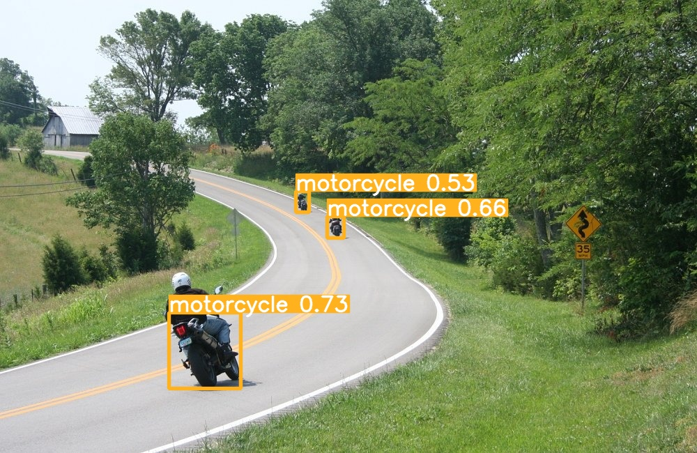
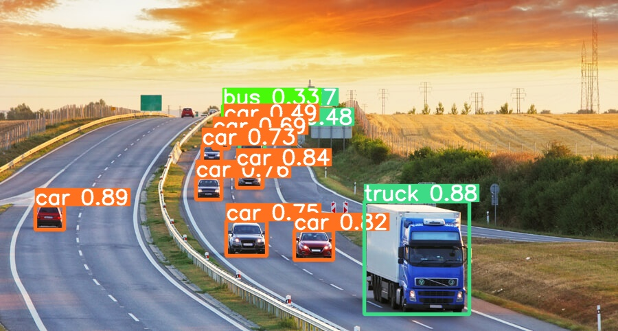

# Vehicle Detection

<!-- TABLE OF CONTENTS -->
<details>
  <summary>Table of Contents</summary>
  <ol>
    <li>
      <a href="#about-the-project">About The Project</a>
      <ul>
        <li><a href="#built-with">Built With</a></li>
      </ul>
    </li>
    <li>
      <a href="#getting-started">Getting Started</a>
      <ul>
        <li><a href="#prerequisites">Prerequisites</a></li>
        <li><a href="#installation">Installation</a></li>
      </ul>
    </li>
    <li><a href="#usage">Usage</a></li>
    <li><a href="#license">License</a></li>
    <li><a href="#contact">Contact</a></li>
    <li><a href="#acknowledgments">Acknowledgments</a></li>
  </ol>
</details>


<!-- ABOUT THE PROJECT -->
## About The Project

we built a vehicle detection project with the use of yolov5 by using our custom dataset

### Built With

* yolov5


<!-- GETTING STARTED -->
## Getting Started

we used google colab to run our yolov5 model to run it with gpu

### Prerequisites

* python

### Installation

1. Clone the repo
   ```sh
   git clone https://github.com/ultralytics/yolov5.git
   ```
2. Install required dependensies
   ```sh
   pip install -r requirements.txt
   ```
3. Enter this command to detect the vehicle images
   ```js
   !python detect.py --weights yolov5s.pt --class 2 3 5 7 --source path/to/folder/orImage
   ```

<p align="right">(<a href="#top">back to top</a>)</p>


<!-- USAGE EXAMPLES -->
## Usage

* we can use this project to detect the presence Vehicles around our surroundings like car, bus, truck, motorcycle.
* [google colab](https://colab.research.google.com/drive/1MpbvGzGSQzhuvHm9DkbcvBbCH024u52P?usp=sharing) will be helpful to run the project 




<!-- LICENSE -->
## License

Distributed under the MIT License. See `LICENSE` for more information.


<!-- CONTACT -->
## Contact

* Jap Hirpara - [linkedIn profile](https://www.linkedin.com/in/jap-hirpara-0b42aa1a1/), email_id - jappatel1704@gmail.com
* Mitali khunt - [linkedIn profile](https://www.linkedin.com/in/mitali-khunt-72a6551b1/), email_id - mitalikhunt19@gmail.com
* Mayur Asodara - [linkedIn profile](https://www.linkedin.com/in/mayur-asodara-366067206), email_id - mayurasodara@gmail.com
* Ayushi Yadav - [linkedIn profile](https://www.linkedin.com/in/ayushi-yadav-028bb21b6), email_id - ayushi9723@gmail.com

Project Link: [https://github.com/jap-patel/Deadly-Animal-Detection](https://github.com/jap-patel/Vehicle_detection)


<!-- ACKNOWLEDGEMENTS -->
## Acknowledgements
* [Ultralytics/yolov5](https://github.com/ultralytics/yolov5)

